# 📧 Self-Hosted Mail Server with Poste.io + Docker + Cloudflare

This documentation explains how to setup a mail server using Poste.io on a VPS.
with Docker Compose and a domain on Cloudflare, including SSL, SPF, DKIM, and DMARC configurations to prevent emails from going to spam.

## 🧩 Architecture Overview

#### Flow

```mermaid
graph LR
    A[🌐 Internet] --> B{☁️ Cloudflare DNS}
    B --> C[🖥️ VPS Server]
    subgraph Docker Container
    C --> D(📧 Poste.io Mail Server)
    end

    style A fill:#f9f,stroke:#333,stroke-width:2px
    style B fill:#f96,stroke:#333,stroke-width:2px
    style C fill:#69f,stroke:#333,stroke-width:2px
    style D fill:#4CAF50,stroke:#fff,stroke-width:4px
```

#### Sequence
```ascii
  [ User ]          [ Cloudflare ]          [ VPS Instance ]
     |                   |                        |
     |---- Request ----> |                        |
     |                   |------- Forward ------> |
     |                   |                  ( Docker Container )
     |                   |                  [ 📧 Poste.io ]
```

- Mailserver: Poste.io (Docker)
- DNS Provider: Cloudflare
- SSL: Let's Encrypt (inside Poste) atau Cloudflare Origin Cert
- Reverse Proxy (optional): Nginx

---

## 🛠️ 1. VPS Requirements

| Resource | Minimum | Recommended |
|----------|---------|------------|
| CPU | 1 core | 2 cores |
| RAM | 1GB | 2GB+ |
| Disk | 10GB | 20GB+ |
| OS | Ubuntu 20.04+ | Ubuntu 22.04 |

* ⚠️ IMPORTANT: Make sure port 25 on your VPS isn't blocked by your provider. You can check with the command: telnet smtp.gmail.com 25.
#### Open port on VPS Firewall
```bash
sudo ufw allow 25,80,443,110,143,465,587,993,995/tcp
sudo ufw reload
```

---

## 🐳 2. Docker & Docker Compose Install

```bash
sudo apt update
sudo apt install docker.io docker-compose -y
sudo systemctl enable --now docker
```

## 📁 3. Create Docker Compose for Poste.io

```bash
mkdir poste
cd poste
nano docker-compose.yml
```

```yml
version: '3'

services:
  poste:
    image: analogic/poste.io
    container_name: poste
    hostname: mail.DOMAIN
    ports:
      - "25:25"
      - "110:110"
      - "143:143"
      - "465:465"
      - "587:587"
      - "993:993"
      - "995:995"
      - "8080:80"   # custom webmail port
      - "8443:443"  # custom HTTPS port
    environment:
      - HTTPS=ON
    volumes:
      - ./data:/data
    restart: always
```
Run container:
```bash
docker compose up -d
```

## ✅ 4. Add Config on Api Gateway - ex: NGINX
#### 🔹 HTTP server (port 80)
```bash
server {
    listen 80;
    server_name mail.DOMAIN;

    location / {
        proxy_pass http://127.0.0.1:PORT;
	      proxy_set_header Host $host;
	      proxy_set_header X-Real-IP $remote_addr;
	      proxy_set_header X-Forwarded-For $proxy_add_x_forwarded_for;
	      proxy_set_header X-Forwarded-Proto $scheme;
    }
}
```
#### 🔹 HTTPS server (port 443)
```bash
server {
    listen 443 ssl http2;
    server_name mail.DOMAIN;

    ssl_certificate /etc/nginx/certs/SSL.cert;
    ssl_certificate_key /etc/nginx/certs/KEY.key;

    location / {
        proxy_pass https://127.0.0.1:10091;
	      proxy_ssl_verify off;
	      proxy_set_header Host $host;
	      proxy_set_header X-Real-IP $remote_addr;
	      proxy_set_header X-Forwarded-For $proxy_add_x_forwarded_for;
	      proxy_set_header X-Forwarded-Proto https;
    }
}
```

## 🌐 5. Cloudflare DNS Configuration - part 1

#### 5.1 A Record (Mail Server)
| Type | Name | Content | Proxy Status | TTL |
| :---: | :---: | :---: | :---: | :---: |
| A | mail | IP_VPS | DNS Only ⚪ (grey) | Auto
* ⚠️ Jangan orange-cloud mail domain.

#### 5.2 MX Record
| Type | Name | Mail Server | TTL | Priority |
| :---: | :---: | :---: | :---: | :---: |
| MX | DOMAIN | mail.DOMAIN | Auto | 10 |

#### 5.3 SPF Record
| Type | Name | TTL | Content |
| :---: | :---: | :---: |  :---: |
| TXT | DOMAIN | Auto | "v=spf1 mx ~all" |

## 🔐 6. SSL Setup (Poste Let's Encrypt)
Masuk ke admin panel:
```bash
https://mail.DOMAIN/admin
```
➡️ Settings → SSL Certificates
➡️ Request Let's Encrypt Certificate

## 🌐 7. Cloudflare DNS Configuration - part 2
#### 7.1 DKIM
- Login Poste admin
- Settings → Domains → DOMAIN → DKIM → Generate Key
- Copy TXT record
- add into cloudflare
  
| Type | Name | TTL | Content |
| :---: | :---: | :---: |  :---: |
| TXT | ex: s20260215607._domainkey | Auto | "k=rsa; ... XXXX" |

#### 7.2 DMARC
| Type | Name | TTL | Content |
| :---: | :---: | :---: |  :---: |
| TXT | _dmarc | Auto | "v=DMARC1; p=none; rua=mailto:MAIN_EMAIL@DOMAINm" |

## 🔗 8.  Useful Links & References
- 🌐 [Official Poste.io Site](https://poste.io/)
- 🐳 [Poste.io Docker Hub](https://hub.docker.com/r/analogic/poste.io/)
- 📜 [DKIM Guide](https://dkim.org/)
